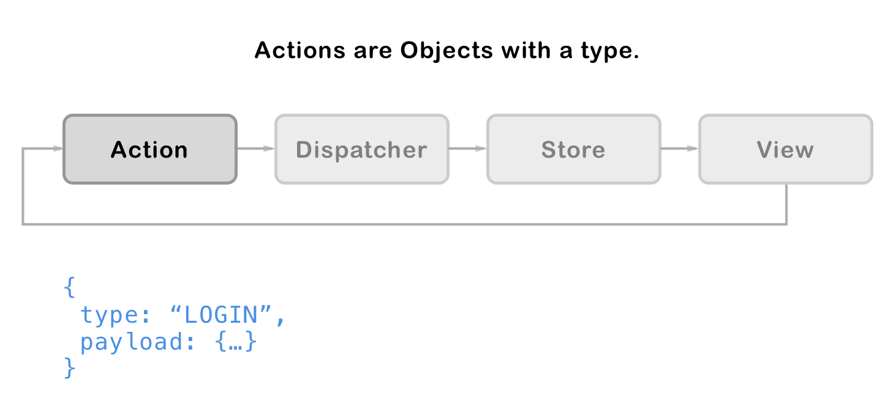
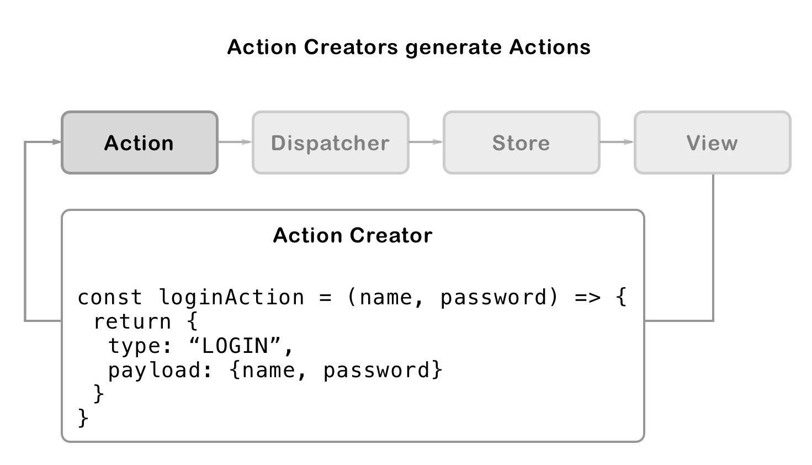
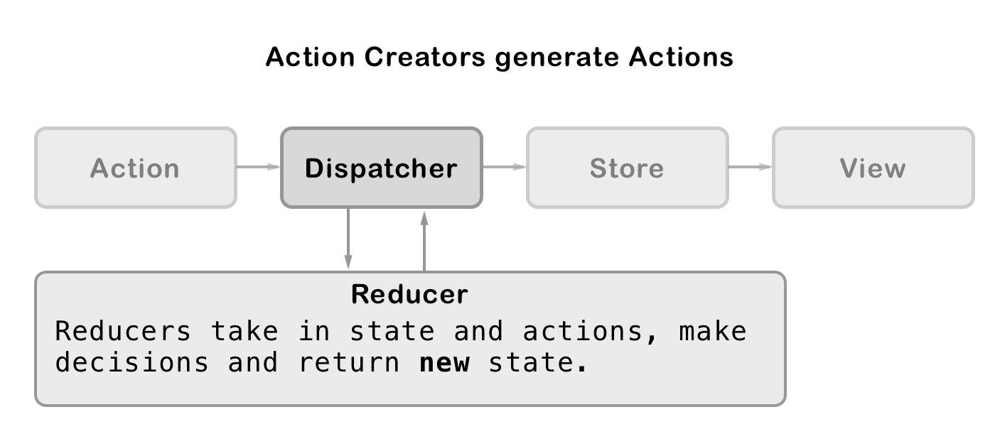
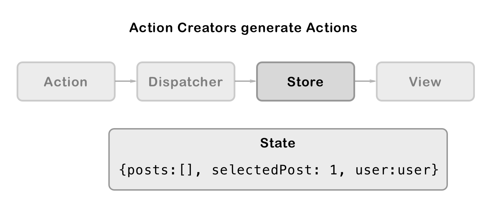
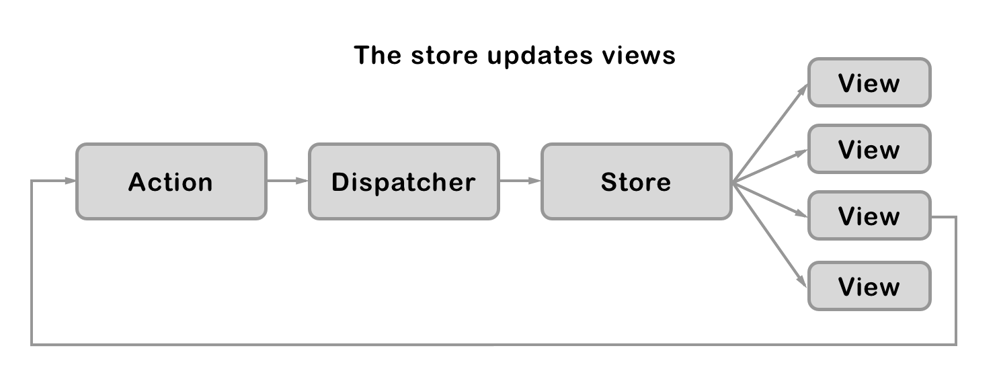

# React Redux

React Redux is a library that connects Redux to your React 
applications. 

The React Redux library adds methods and React Components to 
make the job connecting React to Redux easier. 

## Redux - Actions and Reducers

Redux stores Application state as a single JavaScript Object. We will 
call this the Store. 

The Store is updated by a function called a Reducer. The reducer 
takes the current Application state and an action.

Actions are JavaScript Objects that describe a change that should be 
made to state. 

A view might generate an Action which is sent to the dispatcher.
An Action Object has a type and a payload. Type is a always a 
string, and payload can be any data the reducer might need to 
implement the action. 

Best practice says that we will use a function to generate Actions. 
An Action Creator is a function that generates action Objects. 

The dispatch calls the reducer with the current state and the Action. 
Reducers always return new state after making any changes. 

The store is a JavaScript Object that holds application data. 

After the store is updated data is passed to views. React Redux 
passes data to views as props. 

## Implement React Redux

The following steps implement React Redux in a react project. 

## Add Redux

Import redux into your project. 

`npm i --save redux;`

This adds Redux as a dependancy to the project. There are a few more things we 
to set up before we can implement Redux in React. 

## Add react-redux 

Add react-redux as a dependancy. 

`npm i --save react-redux;`

## Provider

Provider is a Component that provides access to the Redux store to 
it's child components. 

## Connect method 

The connect method connects components to the store for receiving 
state change updates through props, and faciltates sending actions 
to the dispatcher by providing those action creator methods 
through props. 

### mapStateToProps

`mapStateToProps` 

### mapDispatchToProps

## Resources

